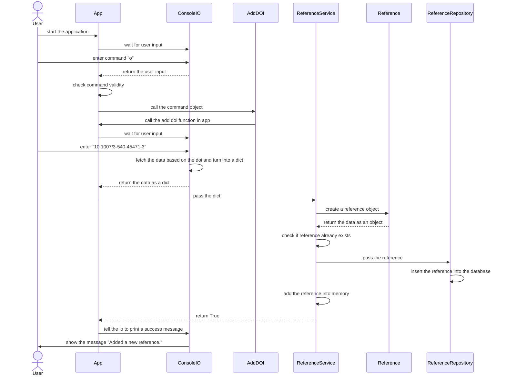

# Architecture

In this document the overall software architecture and implementation are presented. For installation and usage instructions, please refer to the [user manual](manual.md).

This application was made for a software engineering class at the University of Helsinki. The full description of the desired application can be found [here](https://ohjelmistotuotanto-hy.github.io/speksi/) (in Finnish). Not all features were implemented as the project was only worked on for about three weeks.

## Overview

**Minitex** is a command-line application for managing academic references in the BibTeX format. The application is written in the Python programming language. Some external libraries are utilized. *Colorama* is used for coloring the console output, mainly the success and error messages. The *Crossref-commons* module is used for fetching reference data based on a DOI. *Invoke* is used for running various tasks from the command line.

For testing the application utilizes the Robot framework via the *robotframework* module. *Pytest* is used for unit testing and *pylint* for linting and enforcing a consistent code style in the application.

For a full list of dependencies, see [pyproject.toml](../pyproject.toml).

## Functionality

Here is an example of how the application functions. In this example, the user inputs a *Digital Object Identifier* (DOI) and a new reference is inserted into the database.



## Continuous integration

[GitHub Actions](https://github.com/features/actions) was used for continous integration. A [configuration file](../.github/workflows/main.yml) defines the workflow as follows:

1. Set up Python version 3.10.8
2. Install Poetry
3. Install dependencies
4. Run tests with pytest
5. Run user story tests with Robot framework
6. Generate a coverage report
7. Push the report to codecov.io
8. Run pylint to check the code style

## Testing

Various methods and technologies were used to test the application. For unit tests, [pytest](https://docs.pytest.org/en/7.2.x/) was used. [Coverage](https://coverage.readthedocs.io/en/6.5.0/) was used to generate a test coverage report.

For user story testing, the [Robot Framework](https://robotframework.org/) was utilized. User story tests can be found in the `tests` directory in the files ending with `.robot`.

## Database

All data is stored in an SQLite3 database using the `sqlite3` module. The database only has one table for storing book references.

```sql
CREATE TABLE bookreferences (
    id INTEGER PRIMARY KEY,
    author TEXT,
    title TEXT,
    year INTEGER,
    publisher TEXT
)
```

## Project structure

The project has the following file structure. The directory `.github` contains the workflow files needed for continuous integration with GitHub Actions. All database and BibTeX files can be found in the `data` folder. Documentation is stored in `docs`. Source code can be found in the `src` directory. Various configuration files can be found at the root of the repository.

```
├── .github
│   └── workflows
│       └── main.yml
├── data
│   ├── database.db
│   ├── database-test.db
│   └── references.bib
├── docs
│   ├── architecture.md
│   ├── manual.md
│   └── raportti.md
├── src
│   ├── entities
│   │   ├── __init__.py
│   │   └── reference.py
│   ├── repositories
│   │   ├── __init__.py
│   │   └── reference_repository.py
│   ├── services
│   │   ├── __init__.py
│   │   └── reference_service.py
│   ├── tests
│   │   └── ...
│   ├── utils
│   │   ├── __init__.py
│   │   ├── commands.py
│   │   └── validators.py
│   ├── app.py
│   ├── AppLibrary.py
│   ├── config.py
│   ├── console_io.py
│   ├── database.py
│   ├── file_writer.py
│   ├── index.py
│   └── stub_io.py
├── .coveragerc
├── .env
├── .env.test
├── .gitignore
├── .pylintrc
├── poetry.lock
├── pyproject.toml
├── pytest.ini
├── README.md
└── tasks.py
```
